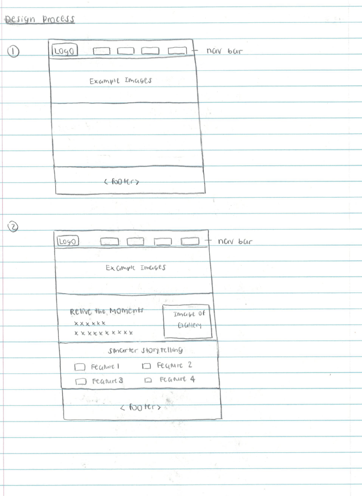
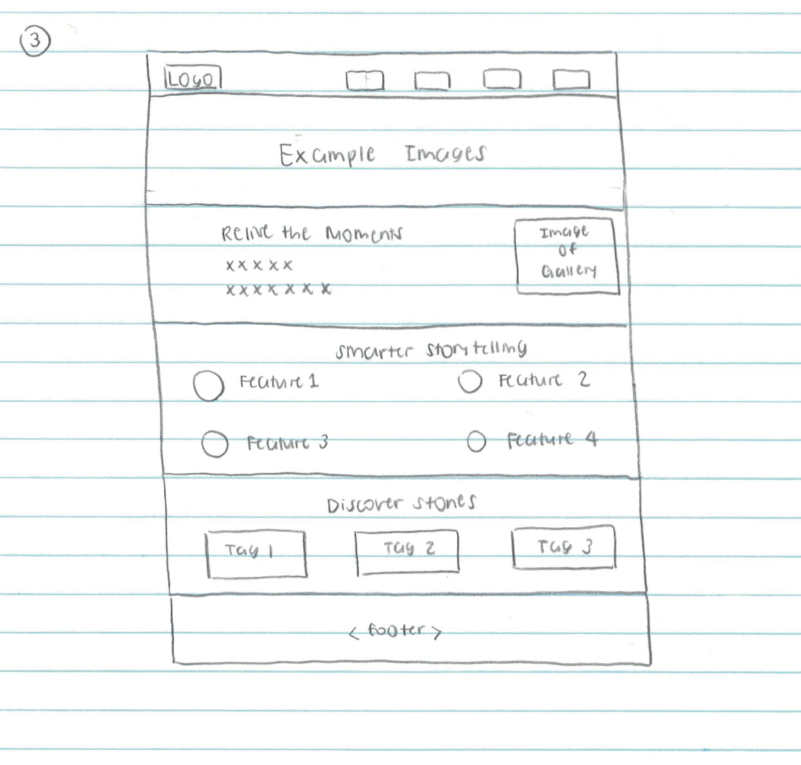
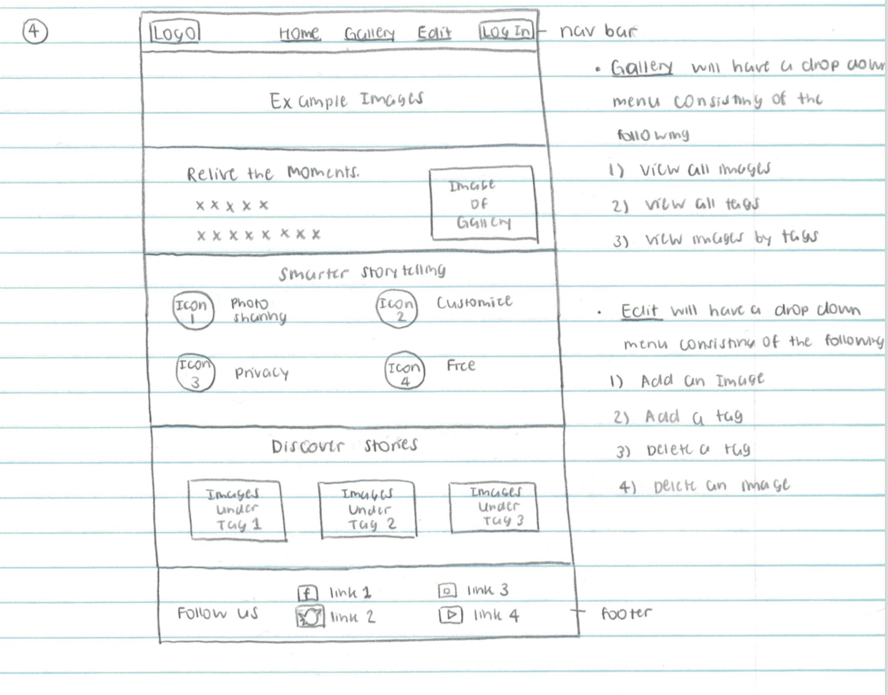
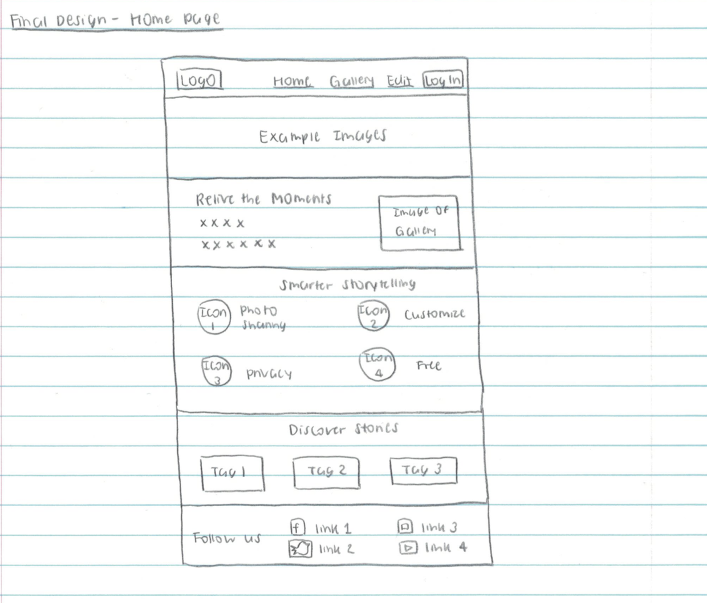
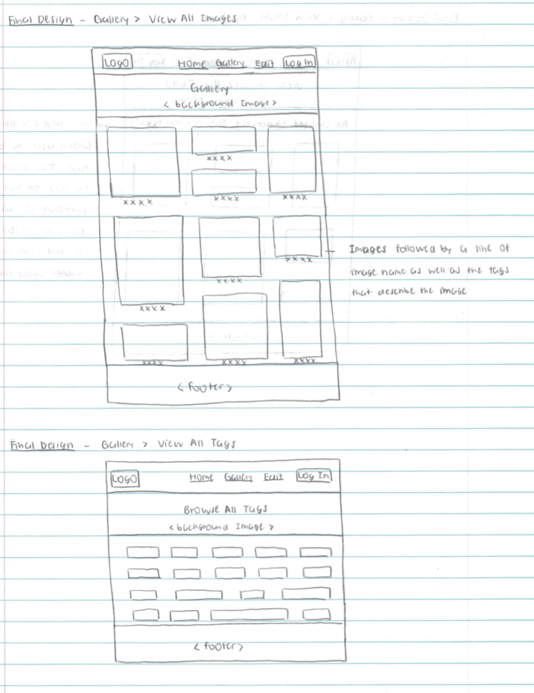
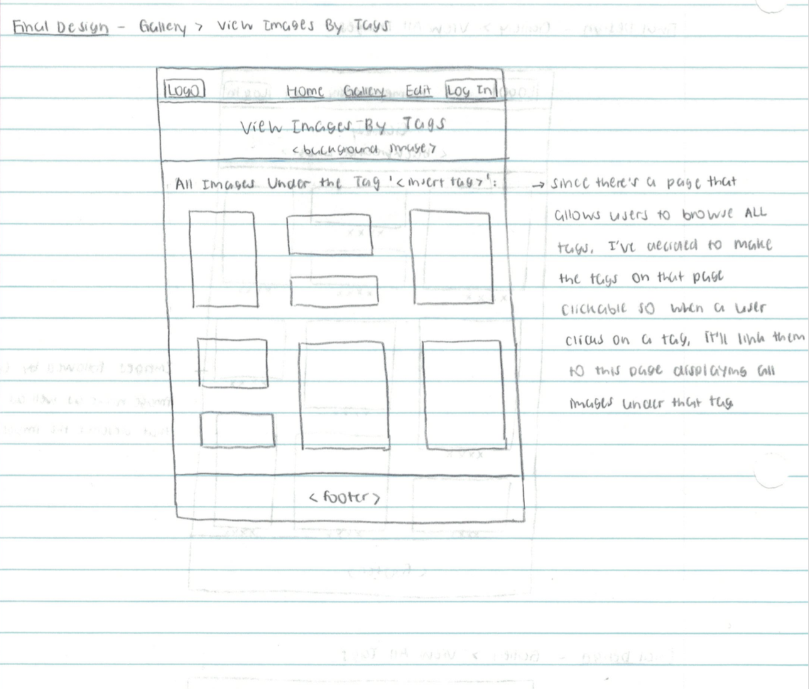
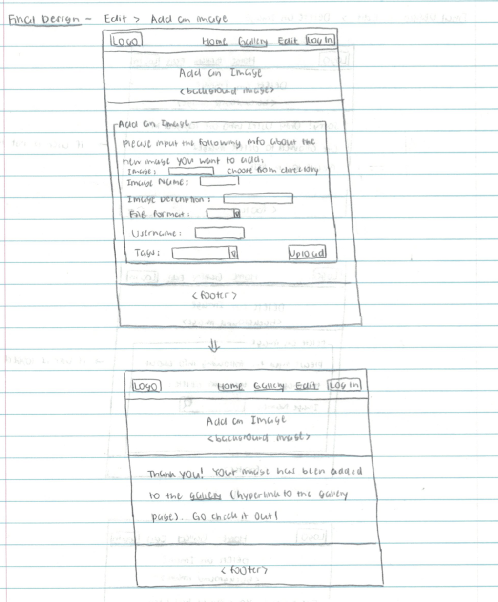
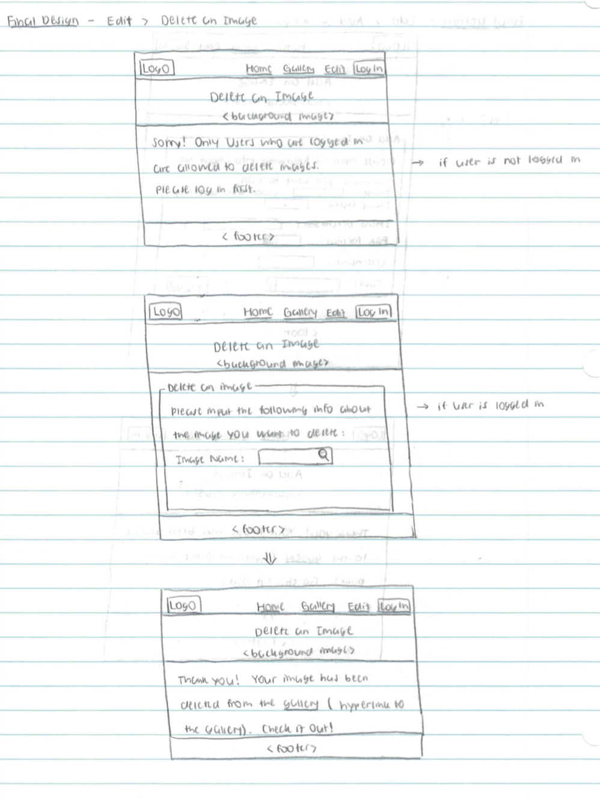
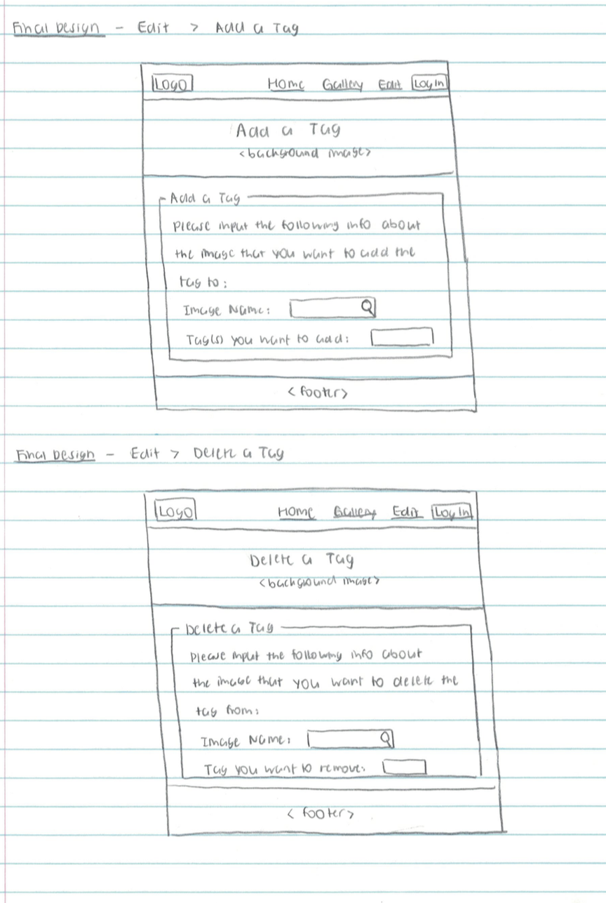

# Project 3: Design Journey

Your Name: [Jane Zhang]

**All images must be visible in Markdown Preview. No credit will be provided for images in your repository that are not properly linked in Markdown. Assume all file paths are case sensitive!**


# Project 3, Milestone 1 - Design, Plan, & Draft Website

## Describe your Gallery

[What will your gallery be about? 1 sentence.]

My gallery will be a collection of traveling images taken from places all over the world.

## Target Audiences

[Tell us about your target two audiences. ~1-3 sentences per audience]

My first target audience are travel fanatics who love traveling and exploring the world and would like to use this photo gallery to share pictures and chronicle memoralbe moments from their previous trips so they can have something to look back on and relive the moments in the future.

My second target audience are people who are beginner travelers/people who are planning an upcoming trip and would like to see some authentic photographs of tourist attractions around the world taken firsthand by other tourists to help them decide where they would like to visit.

## Design Process

[Document your design process. Show us the evolution of your design from your first idea (sketch) to design you wish to implement (sketch). Show us the process you used to organize content and plan the navigation (e.g. card sorting).]

[Label all images. All labels must be visible in Markdown Preview.]





First, I started out with the design of a homepage with 3 navigation tabs: Home, Gallery and Edit, as well as a Log In button on the upper right corner.

Then, I decided to include an image with a tagline promoting the gallery below the navigation bar, followed by a "Relive the Moments" section highlighting features of the online gallery.

Underneath "Relive the Moments", I've decided to include a "Discover Stories" section featuring highlights from some of the most famous tourist attractions in the world(I put in temporary placeholding images for now and will replace them in the later milestone).

Finally, I decided to incorporate a footer displaying the social media platforms of the travel gallery.

Content covered in card sorting includes:
-a gallery consisting of all images
-an add function allowing users to add an image with or without tags to the gallery
-a delete function allowing users to delete an image from the gallery
-a page of all tags displayed, with each linking the user to a page of images under that tag
-a "Discover Stories" that highlights some of the most famous tourist attraction/vacation spots around the world
-a "Relive the Moments" section that serves as a brief description of the functino of the gallery
-a "Smart Storytelling" section that outlines the advantages/benefits of the photo gallery

I decided to ultimately remove the "smart storytelling" from the homepage design since it wasn't directly relevant to the purpose of the website. The website serves as a platform for users to add/delete from an open-to-all, public gallery and I originally intended the smart storeytelling to emphasize the personalized private gallery that only the user who created it can access, which goes against the princiiple behind creating the gallery.


## Final Design Plan

[Include sketches of your final design here.]

The final sketches are as follows:







## Templates

[Identify the templates you will use on your site.]

The templates I am using on my site include a header (with a logo and a navigation bar) as well as a footer (with social media links).

## Database Schema Design

[Describe the structure of your database. You may use words or a picture. A bulleted list is probably the simplest way to do this. Make sure you include constraints for each field.]

[Hint: You probably need `users`, `images`, `tags`, and `image_tags` tables.]

[Hint: For foreign keys, use the singular name of the table + _id. For example: 1) `user_id` in the `images` table or 2) `image_id` and `tag_id` for the `image_tags` table.]

```
users (
id : INTEGER, PRIMARY KEY, UNIQUE, NOT NULL, AUTOINCREMENT
username : TEXT
password: TEXT
)
```

```
images (
image_id : INTEGER, PRIMARY KEY, UNIQUE, NOT NULL, AUTOINCREMENT
user_id: INTEGER, NOT NULL
image_name: TEXT
image_description: TEXT
file_type: TEXT
source_name: TEXT
source_link: TEXT
)
```

```
tags (
tag_id : INTEGER, PRIMARY KEY, UNIQUE, NOT NULL, AUTOINCREMENT
tag_name : TEXT
)
```

```
image_tags (
image_tags_id : INTEGER, PRIMARY KEY, UNIQUE, NOT NULL, AUTOINCREMENT
tag_id : INTEGER
image_id: INTEGER
)
```
## Code Planning

[Plan what top level PHP pages you'll need.]
gallery.php, login.php

[Plan what templates you'll need.]
header.php, footer.php

[Plan any PHP code you'll need.]

```
function is_user_logged_in() {
  if user is logged in, return true
  otherwise, return false
}

// Show logout, only if user is logged in.
if user is logged in (is_user_logged_in()) then
  show logout link
else
  show login link
end

function log_in {
  if username and password input matches those stored in database, execute login
  otherwise, display warning message "wrong password"
}

if (is_user_logged_in()){
  if user is logged in, create a new session id and store in the column session_id in the users table
  record the log in time and store it in the login_time column in the users table
}else{
  otherwise, delete session_id from the users table and record the log out time and store it in the logout_time column in the users table
}

if(user clicks on submit button of the delete image form){
  first check user ownership to see if they have permission and if they do, delete entry from database; otherwise, display a warning message
}

if(user clicks on submit button of the delete tag form){
  delete the corresponding entry in the image_tags table
}

if(user clicks on submit button of the add image form){
  add a new entry in images table, add entries in image_tags if user inputs a tag for the picture
}

if(user clicks on submit button of the add tag form){
  add a new entry in image_tags table
}
```
## Database Query Plan

[Plan your database queries. You may use natural language, pseudocode, or SQL.]
```
//add a new image with no tag
INSERT INTO `images` (image_id,image_name,image_description,file_type) VALUES ();

//add a new image with tag(s)
INSERT INTO `images` (image_id,image_name,image_description,file_type) VALUES ();
INSERT INTO `image_tags` (image_tags_id,tag_id,image_id) VALUES ();

//delete an image
DELETE FROM `images` (image_id,image_name,image_description,file_type) VALUES ();
DELETE FROM `image_tags` (image_tags_id,tag_id,image_id) VALUES (); --> for all tags that the image had

//add a tag
INSERT INTO `image_tags` (image_tags_id,tag_id,image_id) VALUES ();

//delete a tag
DELETE FROM `image_tags` (image_tags_id,tag_id,image_id) VALUES ();
```

# Project 3, Milestone 2 - Gallery and User Access Controls

## Issues & Challenges

[Tell us about any issues or challenges you faced while trying to complete milestone 2. 2-4 sentences/bullet points]

The challenge I faced during milestone 2 was to make sure that once the user logs into the account, he/she stayed logged in while browsing other pages, I am still trying to figure this out.
Another challenge I faced was to make the log in button disappear after the user logs in.
In addition, another issue I ran into was figuring out how to dispaly the files that a user added after he/she fills out the add image form.

# Final Submission: Complete & Polished Website

## Reflection

[Take this time to reflect on what you learned during this assignment. How have you improved since starting this class? 2-4 sentences]
I learned to use query parameters to construct urls for each individual image and tag rather than hard coding and creating a separate webpage for each.
I also learned how to implement login/logout feature, assigning a cookie session to each user who is logged in and automatically logging them out after an hour of inactivity.
In addition, I also deepened my knowledge of SQL queries and learned to use differnt types of joins (INNER JOIN, LEFT JOIN, RIGHT JOIN, etc.) in order to access desired fields within a table.
I have become a lot more comfortable with designing forms and accessing user input from the form in order to perform backend queries. I am also a lot more proficient in the implementation of a two-column and three-column layouts.
